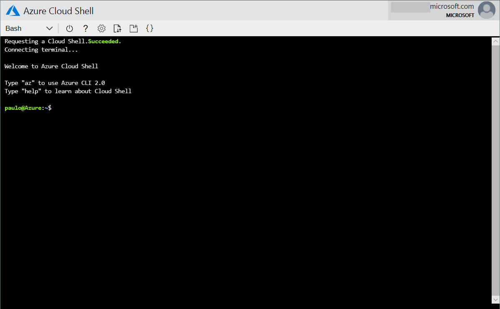

# Photoscan-template
Sample templates and scripts that deploys [Agisoft Photoscan](http://www.agisoft.com) product in Azure. This template was designed to work with another sample template that deploys BeeGFS storage solutio, for a complete end-to-end scenario please deploy [this](https://github.com/paulomarquesc/beegfs-template) template first. This is not a hard-requirement, you can use other storage solutions but the template will offer full automation if you rely on that BeeGFS template, otherwise, make sure you make the necessary adjustments in your cloned template.

In summary, this template will deploy a virtual network with the following components:


This solution is break down into the following components, infrastructure items (Active Directory), Jumpboxes so you can connect to the environment, the Photoscan Scheduler (head) node and the processing nodes, finally, if you are using BeeGFS as your backend storage deployed using this [beegfs-template](https://github.com/paulomarquesc/beegfs-template), you can automatically peer the two virtual networks and install BeeGFS client on your processing nodes automatically with this template.

A sample deployment script called Deploy-AzureResourceGroup.sh is provided with this solution and you can use it to help automate your deployment. This is a minimal sample command line example which creates a staging storage account to hold all deployment related files (if you don't provide the storage account name and its resource group, it will keep creating new storage accounts:

```bash
./Deploy-AzureResourceGroup.sh -g myResourceGroup -l eastus -r support-rg -v keyvaultname
```

## Prerequisites
1. An Azure Key Vault with the following secrets with their values created
    *  adminPassword - this will be your Domain Admin and Local Windows Administrators password
    *  activationCode - this is the Photoscan activation code, make sure you have a valid code or request a trial at their web site.
    
2. To get end to end automation, please deploy this [BeeGFS](https://github.com/paulomarquesc/beegfs-template) template first.
   
3. Please make sure you review the parameter file before starting the deployment.

## Deployment Steps

### Sign in to Cloudshell
1. Open your browser and go to <a href="https://shell.azure.com" target="_new">https://shell.azure.com</a>

1. Sign on with `Microsoft Account` or `Work or School Account` associated with your Azure subscription

    


1. If you have access to more than one Azure Active Directory tenant, Select the Azure directory that is associated with your Azure subscription
    
    

1. If this is the first time you accessed the Cloud Shell, `Select` "Bash (Linux)" when asked which shell to use.

    

    > Note: If this is not the first time and it is the "Powershell" shell that starts, please click in the dropdown box that shows "PowerShell" and select "Bash" instead.

1. If you have at least contributor rights at subscription level, please select which subscription you would like the initialization process to create a storage account and click "Create storage" button.
    

1. You should see a command prompt like this one:
    


### Cloning the source sample project
1. Change folder to your clouddrive so any changes gets persisted in the storage account assigned to your cloudshell
   ```bash
   cd ~/clouddrive
   ```
1. Clone this repository with the following git command
   ```bash
   git clone https://github.com/paulomarquesc/photoscan-template.git
   ```
1. Change folder to photoscan-template
   ```bash
   cd photoscan-template
   ```
1. Review and change the parameters files before deploying
   *  azuredeploy.parameters.json

1. Execute the deployment script the template (make sure you change command line arguments)
    * azuredeploy.json
        ```bash
        ./Deploy-AzureResourceGroup.sh -g photoscan-rg -l eastus -s storageaccountname -r storage-account-rg -v mykeyvault
        ```

### Deploying Windows worker nodes instead of Linux OS
By default the template deploys the worker nodes as Linux VMs, for an end-to-end experience, this is the option that will be able to integrate automatically to BeeGFS parallel file system storage if it was deployed using the beegfs template indicated in the pre-requisites.
If you want to deploy Windows worker nodes, storage configuration will need to be manual because I'm not providing any storage option for this scenario, to get Windows nodes, please make sure you change the following parameters to these values before deploying this template:

**azuredeploy.parameters.json -> useBeeGfsStorage**

From
```json
    "useBeeGfsStorage":{
      "value":"yes"
    },
```
To
```json
    "useBeeGfsStorage":{
      "value":"no"
    },
```

**azuredeploy.parameters.json -> workerNodesType**

From
```json
    "workerNodesType":{
      "value": "linux"
    },
```
To
```json
    "workerNodesType":{
      "value": "windows"
    },
```

### List of parameters per template and their descriptions
#### azuredeploy.parameters.json
* **_artifactsLocation:** Auto-generated container in staging storage account to receive post-build staging folder upload.
* **_artifactsLocationSasToken:** Auto-generated token to access _artifactsLocation.
* **location:** Location where the resources of this template will be deployed to. Default Value: `eastus`
* **vnetName:** Virtual Network Name. Default Value: `Photoscan-vnet`
* **vnetAdressSpace:** Virtual Network Address Space. Default Value: `10.0.0.0/16`
* **jumpboxSubnetName:** Jumpbox subnet name. Default Value: `Jumpbox-SN`
* **jumpboxSubnetAdressPrefix:** Jumpbox subnet address prefix. Default Value: `10.0.0.0/24`
* **photoscanSubnetName:** Photoscan servers (Scheduler+Node) subnet name. Default Value: `Photoscan-SN`
* **photoscanSubnetAdressPrefix:** Photoscan subnet address prefix. Default Value: `10.0.1.0/24`
* **adSubnetName:** Subnet where Domain Controllers will be deployed to. Default Value: `AD-SN`
* **adSubnetAdressPrefix:** AD subnet address prefix. Default Value: `10.0.2.0/24`
* **deployLinuxJumpbox:** Should this template deploy a Linux Jumpbox. Default Value: `no`
* **useBeeGfsStorage:** Should this template use BeeGfs storage. Default Value: `no`
* **adminUsername:** Name of admin account of the VMs, this name cannot be well know names, like root, admin, administrator, guest, etc.
* **adminPassword:** Admin password.
* **dc1Name:** Domain Controller 1 Name. Default Value: `DC-01`
* **dc2Name:** Domain Controller 2 Name. Default Value: `DC-02`
* **dc1IpAddress:** Domain Controller 1 IP Address. Default Value: `10.0.2.4`
* **dc2IpAddress:** Domain Controller 2 IP Address. Default Value: `10.0.2.5`
* **dcVmSize:** Domain Controller VM Size. Default Value: `Standard_DS2_v2`
* **dnsDomainName:** Active Directory FQDN. Default Value: `testdomain.local`
* **adDomainNetBIOSName:** Active Directory NetBIOS domain name. Default Value: `TESTDOMAIN`
* **useSingleResourceGroup:** Whether or not use multiple resource groups, if using multiple, please change the resource groups manually in the variables section. Default Value: `yes`
* **sshKeyData:** SSH rsa public key file as a string.
* **activationCode:** Photoscan Activation Code.
* **headServerName:** Photoscan Server (head) name. Default Value: `headnode`
* **headRoot:** Root path where the projects are located for Server. Default Value: `\\beegfs\beegfsshare\Projects`
* **nodeNameSuffix:** Name suffix to be used in the GPU Nodes. Default Value: `workernode`
* **nodeRoot:** Root path where the projects are located for Nodes. Default Value: `/beegfs/beegfsshare/Projects`
* **nodeSubnetIpAddressSuffix:** Nodes will have static Ip addresses, this is the network part of a class C subnet. Default Value: `10.0.1`
* **nodeStartIpAddress:** Nodes will have static Ip addresses, this is the start number of the host part of the class C ip address. Default Value: `20`
* **dispatch:** Ip address of the photoscan server (head). Default Value: `10.0.1.250`
* **gpuMask:** Decimal represention of how many GPUs will be enabled for processing. E.g. 15 means 1111, that is equal to 4 GPUs. Default Value: `15`
* **gpuNodesVmSize:** GPU VM Size. Default Value: `Standard_NC6s_v2`
* **gpuNodesCount:** Number of GPU VM Nodes. Default Value: `2`
* **headVmSize:** Head node VM Size. Default Value: `Standard_D4S_v3`
* **beeGfsVnetRG:** BeeGFS Vnet Resoure group name. Default Value: `beegfs-rg-eus`
* **beeGfsVnetName:** BeeGFS Virtual Network name. Default Value: `beegfs-vnet`
* **linuxPhotoscanDownloadUrl:** Photoscan Linux binaries download URL. Default Value: `http://download.agisoft.com/photoscan-pro_1_4_4_amd64.tar.gz`
* **windowsPhotoscanDownloadUrl:** Windows binary Photoscan download URL. Default Value: `http://download.agisoft.com/photoscan-pro_1_4_4_x64.msi`
* **photoscanInstallPath:** Photoscan installation path. Default Value: `/`
* **beeGfsMasterName:** BeeGFS Master node VM name (single label). Default Value: `beegfsmaster`
* **beeGfsMasterIpAddress:** BeeGFS Master Ip address, this will be added as an A record on DNS. Default Value: `192.168.0.4`
* **beeGfsMountPoint:** Folder path where BeeGFS volume will be mounted. Default Value: `/beegfs`
* **beeGfsSmbServersVip:** Ip Address of the BeeGFS SMB clients Load Balancer,this will be added as an A record on DNS. Default Value: `192.168.0.55`
* **beeGfsSmbServerARecordName:** BeeGFS A record to be used by Photoscan Server (Head). Default Value: `beegfs`
* **photoscanAbsolutePaths:** Use Photoscan absolute paths. 0 = No, 1= Yes. Default Value: `0`
* **windowsJumpboxVmSize:** Windows Jumpbox VM Size. Default Value: `Standard_DS2_v2`
* **linuxJumpboxVmSize:** Linux Jumpbox VM Size. Default Value: `Standard_DS2_v2`
* **windowsJumpboxVmName:** Windows Jumpbox VM Name. Default Value: `wjb-01`
* **linuxJumpboxVmName:** Linux Jumpbox VM Name. Default Value: `ljb-01`
* **windowsJumpboxIpAddress:** Windows Jumpbox VM Ip Address. Default Value: `10.0.0.4`
* **linuxJumpboxIpAddress:** Linux Jumpbox VM Ip Address. Default Value: `10.0.0.5`
* **beegfsHpcUserHomeFolder:** This indicates beegfs mount point on master and storage+meta nodes for the hpcuser home folder, mounted on all nodes. Default Value: `/mnt/beegfshome`
* **hpcUser:** Hpc user that will be owner of all files in the hpc folder structure. Default Value: `hpcuser`
* **hpcUid:** Hpc User ID. Default Value: `7007`
* **hpcGroup:** Hpc Group. Default Value: `hpcgroup`
* **hpcGid:** Hpc Group ID. Default Value: `7007`

## References
BeeGFS - https://www.beegfs.io

BeeGFS Deployment Template - https://github.com/paulomarquesc/beegfs-template

Agisoft Photoscan - http://www.agisoft.com/