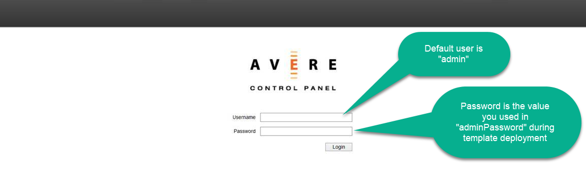
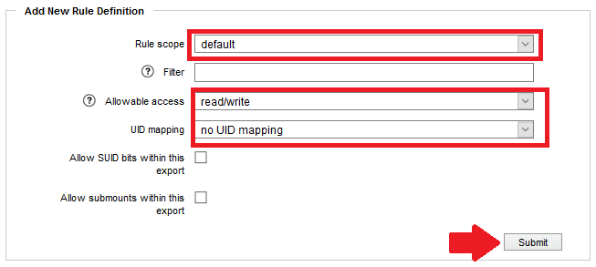

# Avere vFXT post deployment configuration steps for Photoscan template

To start using Avere vFXT with Photoscan template, a few steps must be completed prior to executing the template deployment, in these steps you will create two virtual namespaces, one for the Photoscan data and another one to be the HPC User home folder. For more information about Avere Global Namespaces, please refer to http://library.averesystems.com/ops_guide/4_7/gui_namespace.html at "Using Junctions with Cloud Storage" section. All steps assumes that you are using a jump box that have access to Avere Management Console through a browser.
 
As mentioned before, home export will hold HPC User home folder, that will be shared amongst all Linux Photoscan nodes and will have the shared ssh keys in case HPC User needs to be used to perform some distributed tasks outside of what Photoscan automatically manages. On the other hand, data export will have the Photoscan projects.
 
The following steps will guide you on how to create a new export rule/policy and each export namespace on Avere vFXT Management portal.
 
1. From a jump box or any VM, with a browser that has access to the Avere cluster, open a browser and to go https://`<your vfxt managagement ip>`. E.g. https://10.1.0.6. If you don't known this ip address, one way to obtain is following **steps 3 and 4** of [this](./docs/EstablishingSslVpn.md) document.
1. Enter your Avere vFXT user name and password

    

1. You will see the dashboard, please click on "Settings" tab

    

1. To create a new export rule to allow all files be owned by HPC User and HPC Group, click on "Export Rules"

    

1. Click on "Create new policy"

    

1. Type the new policy name, in this example, we're using "photoscan" and click "Submit"

      

1. Create a new policy rule, for that, make sure that "Policy" combobox is changed to the newly created policy, in this example is "photoscan" as follows and click "Add new rule"

    

1. At "Add New Rule Definition" box, change "Rule scope" to "default", "Allowable access" to "read/write" and "UID mapping" to "no UID mapping', we are using this in order to let control of UID and GID association be the user executing photoscan and they will map to 7007 for both UID and GID (hpcuser and hpcgroup). After these changes, check if your settings are exactly like the ones below and click "Submit"

    

1. Click on "Namespace" and you will see the default namespace called "msazure"

    

1. To create "data" Namespace, click "Create" button

    

1. Make sure that in "Namespace path" field you type "/data" and  in "Export subdirectory" you type "data" as highlighted below and select your "Core filer" and the "Core filer export", lastly, on "Export policy", select the policy you created in the previous steps.

    

1. Execute the steps 5 and 6 again, but now with the "/home" and "home" values for "Namespace path" and "Export subdirectory" fields and leave the "Export policy" with the defaults. After all those steps are done you will have a similar list of namespaces as below (make sure that the newly created namespaces and the export policies exactly matches below).

    
