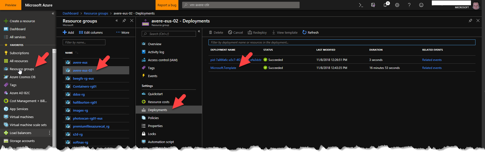
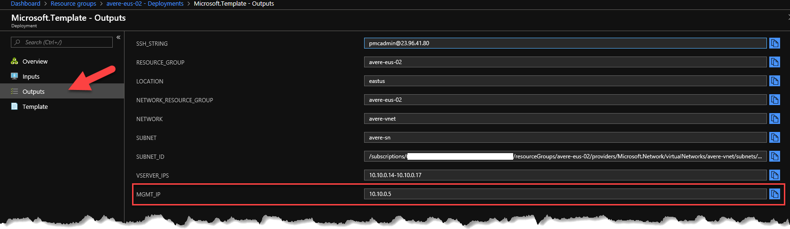
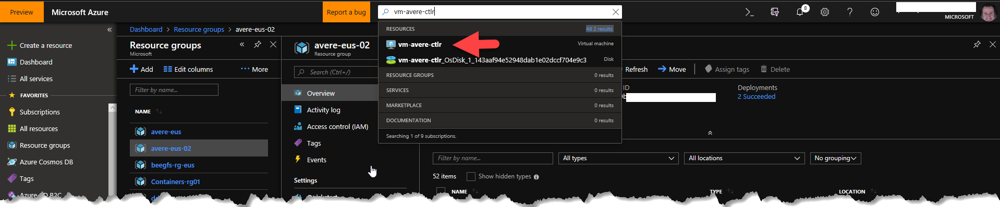
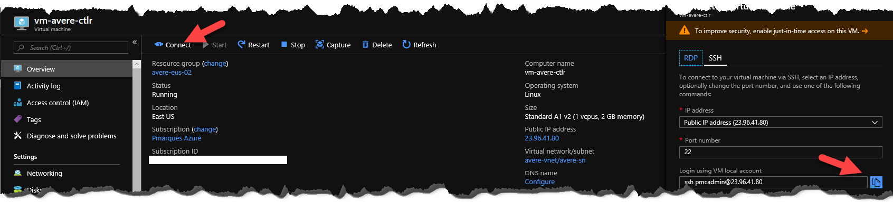
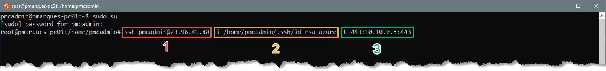
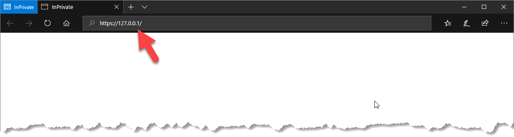
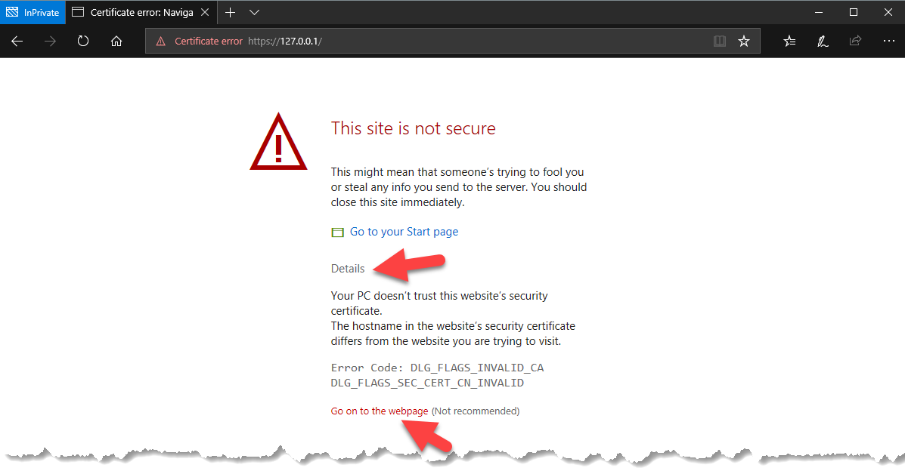
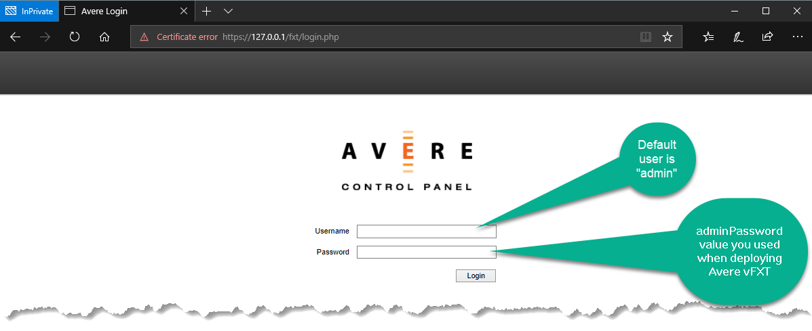

# Establishing temporary SSH tunnel with Avere Controller VM

This procedure shows a quick way to estabilsh a SSH tunnel between a Linux computer or Windows 10 running WSL (Windows Subsystem for Linux) in a way that this allows us to continue the Avere post-deployment steps if we don't have a VPN/Express Route connection with the  virtual network where Avere vFXT cluster is connected to.


1. Make sure that you have access to the SSH Private key related to the SSH Public key used to run the Avere vFXT deployment template.
2. Sign on to Azure Portal (https://porta.azure.com)
3. Obtain the Avere vFXT management ip address by clicking "Resource Groups" in your left-hand side, selecting the resource group where you just deployed your Avere vFXT cluster, clicking "Deployments" then "Microsoft.Template" deployment.

4. When Microsoft.Template's "Deployment" blade appears, click "Outputs" and take note of the MGMT_IP field ip address. This ip address will be used in the ssh command line we will execute in a later step

5. Type the Avere controller VM name in the search field and click the VM in the search list

6. In the Virtual Machine blade, click "Connect" action and then on the right-hand side click in the "Copy" icon

7. In a bash command prompt (notice that this also works on Windows 10 WSL, this example is using Ubuntu on Windows 10), elevate your user as root
```bash
sudo su
```
8. Paste the clipboard contents and make sure that your command line looks similar to this one (with your own values):
```bash
ssh pmcadmin@23.96.41.80 -i /home/pmcadmin/.ssh/id_rsa_azure -L 443:10.10.0.5:443
```
Where

```
1 = Command you copied from "Connect" button of Avere controller VM on step 6
2 = Path for your SSH private key related to the public key you used to deploy Avere vFXT template
3 = Port redirection to 443, it has the managament ip address you obtained while examining the template deployment output on step 4
```
9. Hit [ENTER] in order to connect to the controller VM and establish the SSH tunnel
10. Open your browser and type https://127.0.0.1 in the address bar and hit [ENTER]

11. Avere vFXT deploys the management portal using a self signed certificate, a warning message will be shown, if using Edge, click on "Details" and then "Go to the webpage", make sure you use equivalent options on other browers.

12. Step 11 already proves that your SSH tunnel is working, please notice the callouts of the sign in page. Move forward with your [post deployment steps](./AverePostDeploymentSteps.md)
